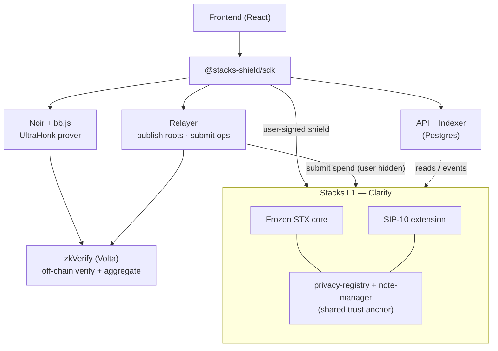
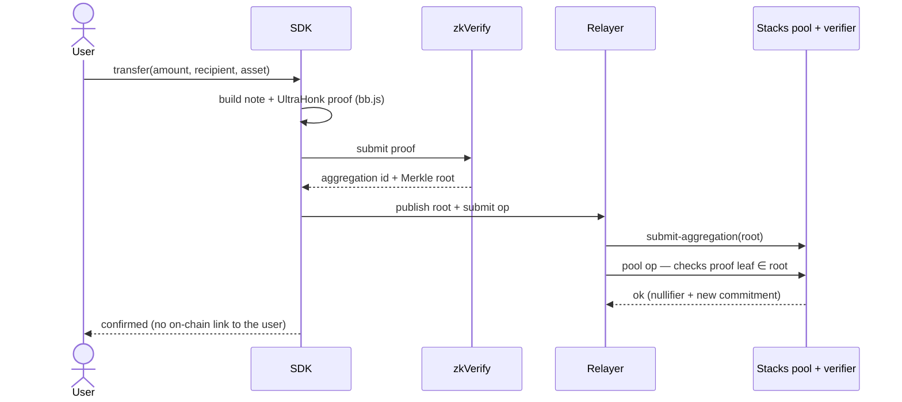
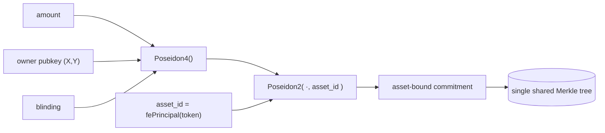
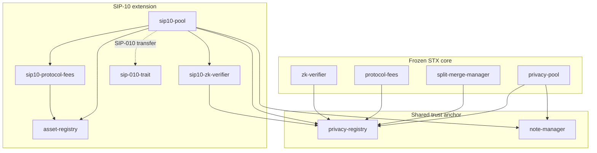

# Stacks Shield

Privacy-preserving transfers on Stacks — for native **STX** and **SIP-10 tokens
(sBTC, USDCx)**. Stacks Shield lets users **shield** an asset into a private
pool, **transfer / split / merge** value privately between opaque notes, and
**withdraw** back to any transparent address — with note ownership, note amounts,
and recipient identities hidden by zero-knowledge proofs (Noir + UltraHonk),
verified through [zkVerify](https://zkverify.io).

📚 Full documentation: [`docs/`](docs/README.md) · Whitepaper: [`docs/whitepaper.md`](docs/whitepaper.md).

> **Status: live on Stacks Testnet.** The complete lifecycle — shield → transfer
> → split → merge → withdraw — runs end-to-end for **STX, USDCx and sBTC** with
> **real proofs and real zkVerify verification**, including relayed transactions
> (the user never appears on chain) and double-spend rejection. Deployer:
> `ST2HXRZ8A82JJAP14KD83JEXNRCF34J67088WJSJH`. Not yet audited; not yet on
> mainnet. See [Honest limitations](#honest-limitations).

---

## System architecture

Seven cooperating layers. The **native STX protocol is frozen**; SIP-10
multi-asset support is a separate, additive extension that reuses the frozen
privacy core, so STX behaviour never changed.



- **Frontend** — multi-asset dashboard (asset selector, per-asset balances, live
  USD), talks only to the SDK.
- **SDK** (`@stacks-shield/sdk`) — the single integration surface; hides
  contracts, relayer, zkVerify, Merkle tree, nullifiers, commitments.
- **Prover** — UltraHonk proofs generated client-side (`@aztec/bb.js` WASM),
  browser and Node, no native toolchain.
- **zkVerify** — verifies proofs off chain and aggregates them into a Merkle
  root (Clarity can't verify UltraHonk natively — see [trust model](#trust-model)).
- **Relayer** — publishes aggregation roots on chain and submits the spend **as
  the relayer**, so the user never appears; trustless (every parameter is bound
  into the proof).
- **API + indexer** — serves `/assets`, `/stats` (per-asset), `/commitments`,
  encrypted-note feed; never stores amounts, secrets, or nullifier→commitment links.

---

## How it works

1. A **note** is a Poseidon commitment. For STX:
   `Poseidon4(amount, ownerPkX, ownerPkY, blinding)`. For SIP-10 the asset is
   bound in: `Poseidon2(Poseidon4(...), asset_id)` — the chain stores only the
   opaque commitment, never the amount, owner, or which note is spent.
2. The SDK builds an UltraHonk proof (Noir + Barretenberg) that an operation is
   valid: the spender owns the input note, it's in the commitment tree, value is
   conserved, and nullifiers/commitments are well-formed.
3. The proof goes to **zkVerify**, which verifies + aggregates it into a Merkle
   root; a **relayer** publishes that root on chain.
4. The verifier contract accepts the operation only if its statement — a keccak
   hash binding the vkey hash, the version, and the canonical public inputs
   (including `asset_id` for SIP-10) — is included in a published aggregation.
   Change any parameter and the statement changes, so the operation reverts.



*(Shield is the exception: it is user-signed because it moves the user's own
transparent funds into the pool.)*

### Trust model

**Verification is delegated to zkVerify (v1).** Clarity cannot yet verify an
UltraHonk proof natively (no BN254/BLS pairing primitives), so the contracts
trust zkVerify's verification and check cheap **aggregation inclusion** on chain.
This is an explicit, documented dependency, and moving verification onto Stacks
itself is the primary direction of future work — the path from a self-hosted
verifier to fully native on-chain verification is in the
[whitepaper](docs/whitepaper.md#9-toward-native-zk-verification-on-stacks).

---

## Multi-asset design (SIP-10)

Goal: add sBTC/USDCx **without touching the frozen STX protocol** and **without
fragmenting privacy**. The asset is bound cryptographically into the commitment,
while **all assets share one Merkle tree** — a USDCx note can never be spent as
an sBTC note, yet the anonymity infrastructure stays unified.



- **One pool, many assets.** `sip10-pool` handles every registered SIP-10 asset;
  routing (pool / verifier / fee-manager) comes from the on-chain
  `asset-registry`, so **adding a token needs only on-chain registration — no
  code change**.
- **Registry-driven discovery.** The API's `/assets` reads the registry; the SDK
  and UI consume it, so nothing hardcodes a pool or token.
- **Conservation invariant (per asset).** `token.balance(pool) ==
  shielded-total[asset]` (shield adds to both, withdraw subtracts), defending
  against lying / fee-on-transfer tokens.
- **Backward compatible.** Native STX notes (no asset field) still decode and
  spend exactly as before.

---

## Contracts

Frozen native STX core (6) + additive SIP-10 extension (5), all delegating
authority and shared state to the registry.



**Frozen STX core**

| Contract | Role | Errors |
|---|---|---|
| `privacy-registry.clar` | Protocol source of truth — roots, nullifiers, commitments, limits, versions, stats, access control, state machine, relayer registry | `u100–u149` |
| `note-manager.clar` | Shielded-note lifecycle | `u150–u199` |
| `protocol-fees.clar` | Native STX fees & treasury | `u200–u249` |
| `zk-verifier.clar` | zkVerify statement binding + aggregation-inclusion checks | `u300–u349` |
| `privacy-pool.clar` | STX pool (shield / transfer / withdraw), STX custody | `u250–u299` |
| `split-merge-manager.clar` | Private STX note split / merge | `u350–u399` |

**SIP-10 extension** (reuses `privacy-registry` + `note-manager`)

| Contract | Role | Errors |
|---|---|---|
| `sip-010-trait.clar` | The standard SIP-010 trait the pool calls tokens through | — |
| `asset-registry.clar` | Supported-asset registry — uid, token principal, decimals, shield limits, per-asset fee config + recipient | `u400–u449` |
| `sip10-pool.clar` | One pool for all SIP-10 assets — shield / transfer / split / merge / withdraw, asset-bound, per-asset conservation invariant | `u450–u499` |
| `sip10-protocol-fees.clar` | Per-asset token-native fee collection + per-asset treasury | — |
| `sip10-zk-verifier.clar` | Aggregation-inclusion checks for SIP-10 proofs | — |

`mock-sbtc` / `mock-usdc` exist for local testing and are **never deployed** to
testnet (real token contracts are used there).

---

## Operations

- **Shield** — transparent asset → a private note (user-signed; the only
  operation that moves the user's own funds).
- **Transfer** — move a note's ownership privately. Publishes only a nullifier +
  a new commitment; no visible token moves.
- **Split** — one note → two smaller notes (value conserved in-circuit).
- **Merge** — two notes → one note (same asset only).
- **Withdraw** — a note → transparent tokens at any address, minus the fee.

Transfer / split / merge / withdraw can be submitted by a **relayer**, so the
operation lands on chain from the relayer's address and the user never appears.
The relayer is trustless: every parameter is bound into the proof, so it can
submit-or-not but can never alter an amount, recipient, asset, or commitment.

---

## Fees

Per-asset, configured in the registry, mirroring the native STX protocol. Fees
are **user-paid and private** — the shield fee is folded into the transparent
deposit; the withdrawal fee is pulled from the pool `as-contract`, so the public
can never link a fee to a specific person.

| Operation | Rate | Who pays |
|---|---|---|
| Shield | **0.25%** (25 bps) | user, on deposit |
| Withdrawal | **0.30%** (30 bps) | user, out of the payout |
| Transfer / Split / Merge | 0 (flat-only, disabled) | tx-sender (relayer) |

Only shield & withdrawal can take a percentage (their amount is public at that
moment); transfer/split/merge run over hidden amounts, so the contract can only
charge a flat fee there — kept at 0 to avoid the relayer subsidising it. Config
script: `scripts/deployment/sip10/set-sip10-fees.ts`.

---

## Security model

- **Authority is delegated, never duplicated.** Only the registry stores the
  owner, admin roles, and the authorized-caller allowlist; every protected write
  is gated by `contract-caller` against it. Not even the owner can write
  commitments, nullifiers, notes, or fees directly.
- **Double-spend / replay.** Three independent append-only guards: registry
  nullifiers (one registration ever), note states (a spent note never transitions
  again), and the verifier's per-aggregation records.
- **Proof binding.** Each operation's exact parameters (incl. `asset_id`) are
  hashed into the canonical public-input encoding → the zkVerify statement leaf →
  checked for inclusion in a published aggregation. A proof authorizes exactly
  one operation with exactly those parameters.
- **Conservation invariant.** STX pool balance equals the registry's
  `total-shielded-stx`; each SIP-10 asset's pool balance equals its
  `shielded-total`. The accounting gate runs before any tokens move, so a pool
  can never pay out more than is shielded.
- **Layered emergency response.** The registry ACTIVE/PAUSED/EMERGENCY/UPGRADING/
  DEPRECATED state machine composes with per-contract freezes and the pool's
  per-operation switches.
- **Upgrades** flow through the registry's UPGRADING state; versions are
  monotonic and old notes stay spendable across an upgrade.

Details: [docs/security.md](docs/security.md), [docs/architecture.md](docs/architecture.md).

---

## Repository layout

```
contracts/          Clarity: frozen STX core (6) + SIP-10 extension (5) + mocks (not deployed)
zk/
  circuits/         Noir: shield/transfer/withdraw/split/merge + keygen + shared lib
  circuits/sip10/   SIP-10 asset-bound circuit variants
  barretenberg/     UltraHonk proving / verification / vkeys
sdk/                @stacks-shield/sdk — TS client (bb.js proving, Node + browser, NoteVault)
services/
  api/              read-only API + indexers (Fastify + PostgreSQL/Drizzle) — /assets, /stats byAsset
  relayer/          relayer service — publishes roots to both verifiers, submits ops
frontend/           React app — multi-asset dashboard, per-asset + USD, local vault
tests/              vitest suites (contracts, attacks, fuzz, e2e, integration, privacy)
scripts/
  deployment/sip10/ deploy / configure / register-assets / set-sip10-fees / verify
  testnet/          real-proof op runner + SDK e2e suite (STX / USDCx / sBTC)
deployments/        devnet / testnet / mainnet plans + testnet records
docs/               documentation (start at docs/README.md)
```

---

## Quick start

```bash
pnpm install
pnpm test              # contract suites (Clarinet simnet)
pnpm run test:rc       # everything (contracts + invariants + attacks + e2e + fuzz)
```

Using the SDK (multi-asset):

```ts
import { STXShield, localStorageVault } from "@stacks-shield/sdk";

const shield = new STXShield({ network: "testnet", signer, noteVault: localStorageVault() });

await shield.shield(100);                    // 100 STX  -> private note
await shield.shield(1000, "USDCx");          // 1000 USDCx -> private note
await shield.shield(0.5, "sBTC");            // 0.5 sBTC -> private note

await shield.transfer(50, recipient, "USDCx");   // send privately
const { notes } = await shield.split(note, [25, 25]);
const { note: merged } = await shield.merge(notes);
await shield.withdraw(merged, recipient);        // back to transparent tokens
```

Adding a new SIP-10 asset needs **only on-chain registration** in
`asset-registry` — the SDK and UI discover it via `/assets`, no code change.

See [`sdk/README.md`](sdk/README.md) · full docs in [`docs/`](docs/README.md) ·
services in [`services/api`](services/api) and [`services/relayer`](services/relayer).

---

## Honest limitations

Stacks Shield's *design* matches shielded-pool systems; its *assurance* is early.
For a public audience this must be stated plainly (full treatment in the
[whitepaper](docs/whitepaper.md#8-limitations)):

- **Testnet only, unaudited.** No third-party security audit yet; not on mainnet.
- **Small anonymity set.** Privacy is only as strong as the crowd you hide in;
  the current set is small, so today's *practical* privacy is limited regardless
  of the cryptography. A shared tree across assets helps, but usage is still low.
- **Verification is delegated to zkVerify** — a separate chain — rather than done
  in Stacks consensus. A deliberate v1 choice and a real trust/liveness
  dependency the fully-native design would remove.
- **Transparent sides are public.** Shield and withdraw amounts + addresses are
  on chain; privacy is strongest with a busy pool, common amounts, and delay
  between deposit and withdrawal.

---

## License

Apache-2.0 — see [LICENSE](LICENSE).
