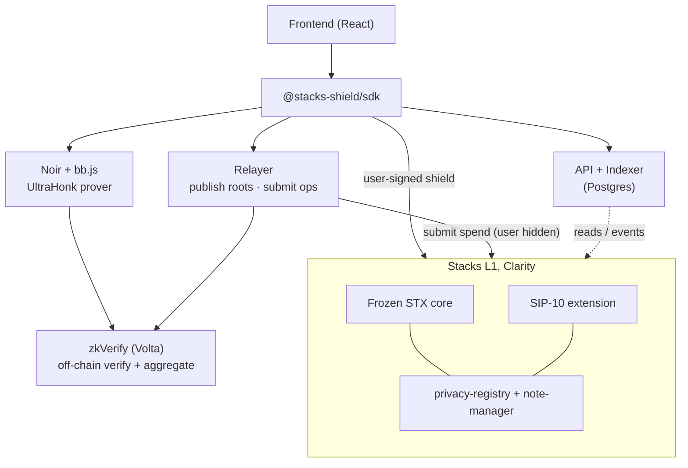
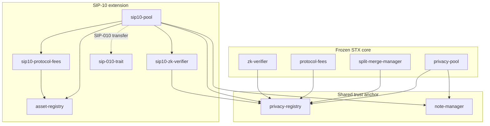

# Architecture

How Stacks Shield is put together, and how a single operation flows through it.
For the protocol itself see the [whitepaper](whitepaper.md).

## The seven layers



| Layer | Where | Responsibility |
|---|---|---|
| **Frontend** | `frontend/` | React app: multi-asset dashboard, asset selector, per-asset balances + live USD, local note vault. Talks only to the SDK. |
| **SDK** | `sdk/` (`@stacks-shield/sdk`) | The one integration surface. Builds notes/proofs, rebuilds the Merkle tree, routes ops, hides everything below. |
| **Prover** | in the SDK (`@aztec/bb.js`) | Generates UltraHonk proofs client-side, browser (WASM threads) and Node, no native toolchain. |
| **zkVerify** | external (Volta) | Verifies proofs off chain, aggregates them into a Merkle root. |
| **Relayer** | `services/relayer/` | Publishes aggregation roots on chain (to both verifiers) and submits spends as the relayer, hiding the user. |
| **API + indexer** | `services/api/` (Postgres) | Indexes contract events; serves `/assets`, `/stats`, `/commitments`, the encrypted-note feed. Stores no secrets or amounts. |
| **Contracts** | `contracts/` | The on-chain protocol: frozen STX core + SIP-10 extension, sharing the registry + note-manager. |

## Contracts



- **Frozen STX core (6):** `privacy-registry` (protocol source of truth, roots,
  nullifiers, commitments, limits, versions, state machine, access control),
  `note-manager`, `privacy-pool`, `split-merge-manager`, `protocol-fees`,
  `zk-verifier`.
- **SIP-10 extension (5):** `sip-010-trait`, `asset-registry`, `sip10-pool`,
  `sip10-protocol-fees`, `sip10-zk-verifier`, reusing `privacy-registry` +
  `note-manager` so the frozen core is untouched.

## Anatomy of an operation

Take a private **transfer** (transfer/split/merge/withdraw all follow this shape;
**shield** is user-signed and skips the relayer):

```mermaid
sequenceDiagram
    actor User
    participant SDK
    participant API
    participant zkVerify
    participant Relayer
    participant Stacks

    User->>SDK: transfer(amount, recipient, asset)
    SDK->>API: GET /commitments (rebuild the tree)
    SDK->>SDK: pick note, build nullifier + new commitment
    SDK->>SDK: prove (Noir + bb.js UltraHonk)
    SDK->>zkVerify: submit proof
    zkVerify-->>SDK: aggregation id + Merkle root
    SDK->>Relayer: publish root + submit op
    Relayer->>Stacks: submit-aggregation(root) → both verifiers
    Relayer->>Stacks: pool op, checks statement ∈ root
    Stacks-->>Relayer: ok (nullifier + new commitment)
    API-->>SDK: indexer observes the event; note discoverable
```

**Notes on the flow:**

- The SDK **rebuilds the commitment tree** from `/commitments` before each op, so
  its membership proof is against the live on-chain root. (This makes the indexer
  a critical dependency, see the deep-dive.)
- A **shield** is signed by the user (it moves their own transparent funds into
  the pool) and now waits for on-chain confirmation before reporting success.
- The relayer publishes each aggregation root to **both** `zk-verifier` and
  `sip10-zk-verifier`, and the SDK waits for the root on the asset's own verifier
  before broadcasting.
- Encrypted note payloads are published to the API; clients **trial-decrypt** the
  feed locally to discover their notes, the server never learns ownership.

## Data the API does and doesn't hold

- **Holds:** commitments (+ leaf index), opaque encrypted-note ciphertext,
  aggregation roots, transaction metadata, per-asset aggregate stats.
- **Never holds:** note amounts, note secrets, viewing keys, or
  nullifier→commitment links.

See also: [privacy model](privacy-model.md) · [security](security.md) ·
[whitepaper](whitepaper.md).
